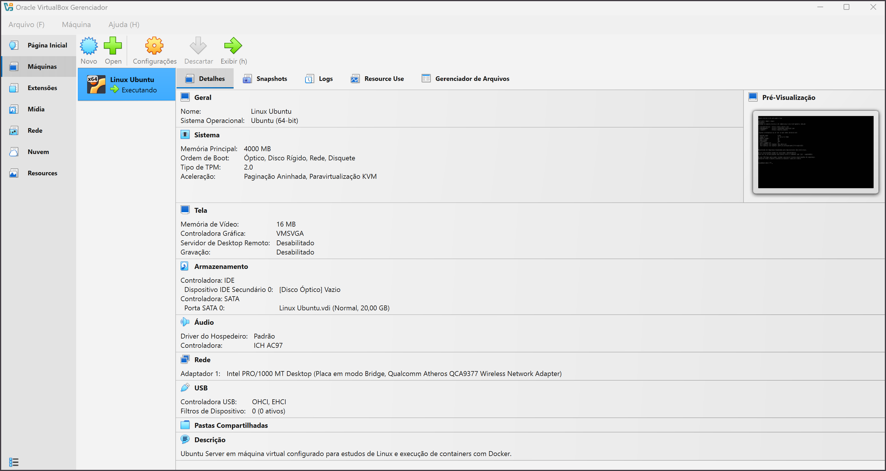
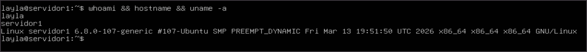

# linux-docker-environment
Ambiente de desenvolvimento Linux com Docker configurado do zero

# 🐧 Linux + Docker Environment (Virtual Machine)

Este projeto documenta a criação de um ambiente de desenvolvimento Linux utilizando máquina virtual e Docker.

## 🚀 Tecnologias utilizadas

* Ubuntu Server
* Docker
* Virtualização com VirtualBox

## 🎯 Objetivo

Criar um ambiente isolado para estudo e execução de containers Docker, simulando um ambiente real de servidor Linux.

## ⚙️ Etapas do projeto

* Criação da máquina virtual
* Instalação do Ubuntu Server
* Configuração inicial do sistema
* Instalação e configuração do Docker
* Execução de containers de teste

## 🖥️ Ambiente

* Windows 11 (host)
* Máquina virtual com Ubuntu Server
* 2 CPUs e 4GB de RAM

## 📸 Demonstração

### 🖥️ Máquina Virtual em execução


### 🐧 Terminal Linux (Ubuntu Server)

<!--
### 🐳 Docker em execução


## 🐳 Teste com Docker

```bash
docker run hello-world
```

## 📚 Aprendizados

* Manipulação de ambiente Linux via terminal
* Gerenciamento de pacotes com apt
* Conceitos de virtualização
* Uso de containers com Docker
-->

🧱 📌 🛠️ Tecnologias e Versões

- VirtualBox: 7.x (Host - Windows)
- Ubuntu Server: 24.04.4 LTS
- Kernel Linux: 6.8.0-110-generic
- Identificação do sistema via: /etc/os-release (padrão moderno)
<!-- 
- Docker: 24.0.7
-->
